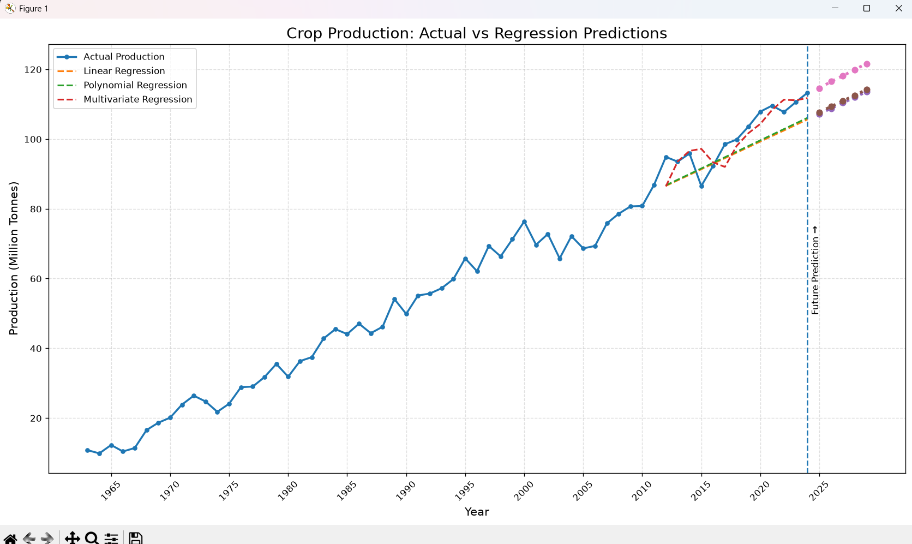

# Practical 1 – Crop Production Prediction Using Machine Learning(Linear,Polynomial and Multivariate)

## Aim

To use a FAOSTAT crop production dataset and apply Machine Learning regression techniques to predict crop production and visualize the results using graphs.

## Dataset

The dataset is obtained from FAOSTAT and contains wheat production data for India.

- Crop: Wheat
- Country: India
- Time Period: 1961–2024
- Unit: Tonnes
- Number of Records: 64

## Machine Learning Models Used

Three regression models were implemented:

1. Linear Regression
2. Polynomial Regression
3. Multivariate Linear Regression

### Features Used

For the multivariate regression model, the following features were used:

- Year
- Previous Year Production
- Production Two Years Ago

The lag features were created from the historical production values.

## Train-Test Split

- Training Period: 1961–2011
- Testing Period: 2012–2024
- Future Prediction: 2025–2029

For the multivariate model, the first two observations are excluded because previous-year and two-years-ago production values are required.

## Evaluation Metrics

The models were evaluated using:

- MAE (Mean Absolute Error)
- RMSE (Root Mean Squared Error)
- R² Score

| Model | MAE | RMSE | R² |
|---|---:|---:|---:|
| Linear Regression | 5,822,126 | 6,220,033 | 0.393 |
| Polynomial Regression | 5,592,179 | 5,960,143 | 0.442 |
| Multivariate Regression | 3,197,892 | 4,518,180 | 0.680 |

## Result

The **Multivariate Linear Regression model performed the best** among the three models.

It achieved:

- Lowest MAE: 3,197,892
- Lowest RMSE: 4,518,180
- Highest R²: 0.680

Therefore, the multivariate model provided the best prediction performance on the test data.

## Future Prediction

The models were also used to predict wheat production for the years:

**2025, 2026, 2027, 2028 and 2029.**

The predicted production values were visualized along with the historical production data.

## Graph

The graph below shows the actual production, model predictions and future predictions.

## Technologies Used

- Python
- Pandas
- NumPy
- Matplotlib
- Scikit-learn

## Files

| File | Description |
|---|---|
| `code.py` | Python implementation of the Machine Learning models |
| `crop_production.csv` | FAOSTAT wheat production dataset |
| `prediction_graph.png` | Graph showing actual and predicted production |

## Conclusion
Linear, Polynomial and Multivariate Regression models were implemented to analyze wheat production data. Based on MAE, RMSE and R² score, Multivariate Linear Regression performed the best. Future wheat production was then predicted for 2025–2029 and visualized using Matplotlib.